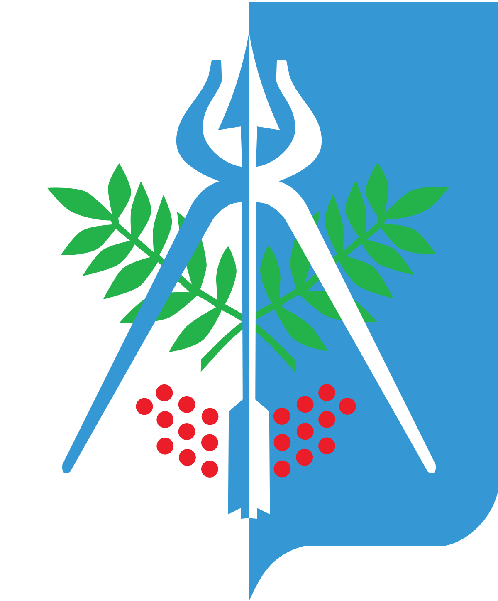
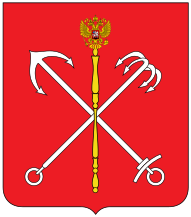

Welcome to my page!

I'm Maxim Tokarev, Backend developer from  **Izhevsk**, currently living in  **St. Petersburg, Russia**.

### Things I code with:
- **.NET 6, .NET Framework 4.8**
- **ASP.NET MVC, ASP.NET Web API**
- **JavaScript**
- **SQL**
- **Entity Framework**
- **HTML/CSS**
- **Git**

### Pet projects:
- **[TrueStoryMVC](https://github.com/mtokar3v/TrueStoryMVC)** : This is a web application written in ASP.NET MVC designed for users to publish something stories or memes, as well as other interesting content. ([Link to website](http://truestory.northeurope.cloudapp.azure.com/))
